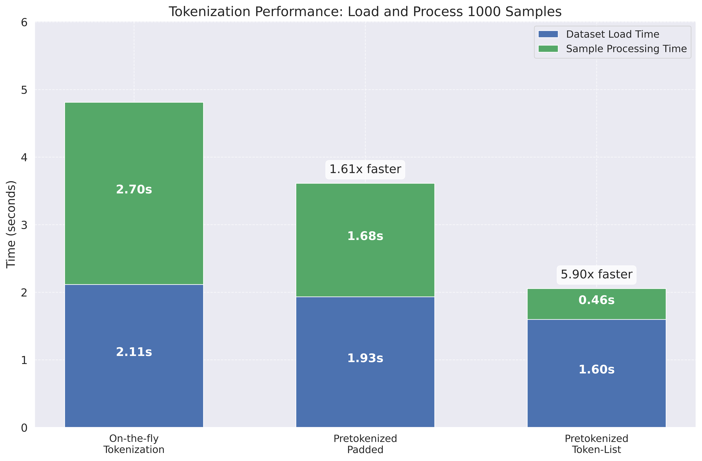

# Large-Scale-AI-Engineering-Project

This repo contains the final project for the "Large Scale AI Engineering" course at ETH Zürich, FS2025. The goal is to implement *Pretokenization* and investigate its effect on training LLMs on large GPU clusters. We conducted our experiments on the Alps cluster at CSCS, which features NVIDIA GH200 GPUs with 120GB of VRAM.

## Project Overview

Training large language models involves converting text to tokens before feeding them to the model. This tokenization process is typically done on-the-fly during training, which can become a bottleneck. This project explores if *pretokenization* - processing the text into tokens beforehand - can improve training efficiency.

We implemented and compared four approaches:
- Standard padded tokenization (baseline)
- Padding-free tokenization (baseline)
- Pretokenized padded format
- Pretokenized token-list format

## Key Findings

- In isolated benchmarks, pretokenization achieved up to **5.9× faster** processing speeds
- The token-list format improved storage efficiency 
- Despite these improvements, overall training throughput showed minimal differences
- Preliminary evidence suggests benefits might increase with larger batch sizes

**For detailed implementation details, methodology, complete results, and analysis, please see [the full report](report/report_pretokenization.md).**

## How to Run

For running on the CSCS Alps cluster, see the SLURM job scripts in the `scripts` directory that configure the environment settings for all experiment configurations and can be started as `sbatch` jobs.

### Step 1: Pretokenize the Dataset

```bash
python pretokenize.py \
  --input-path /path/to/train_data.parquet \
  --output-dir /path/to/output \
  --tokenizer-name unsloth/Mistral-Nemo-Base-2407-bnb-4bit \
  --max-length 2048 \
  --batch-size 100 \
  --format padded token-list
```

This creates two output files:
- `train_data_tokenized_padded_snappy.parquet`
- `train_data_tokenized_token-list_snappy.parquet`

### Step 2: Train Using Pretokenized Data

```bash
python src/train.py \
  --dataset /path/to/train_data_tokenized_padded_snappy.parquet \
  --dataset-type padded \
  --pretokenized \
  --sequence-length 2048 \
  --batch-size 2 \
  --learning-rate 5e-5 \
  --lr-warmup-steps 100 \
  --training-steps 1000
```

For additional run configurations and SLURM job scripts, see the `scripts` directory.

## Project Structure

- `src/preprocessing/pretokenize.py`: Script for pretokenizing datasets
- `src/data/pretokenized_dataset.py`: Dataset implementations for pretokenized data
- `analysis/`: Benchmark and analysis scripts
- `scripts/`: SLURM job scripts for CSCS Alps cluster
- `report/`: Detailed project report and findings

## Preview: Tokenization Performance

The chart below shows the remarkanle processing speedup achieved by pretokenization in isolation, though this doesn't directly translate to overall training speed improvements as explained in the full report.



However, this dramatic speedup doesn't directly translate to overall training performance. With `batch_size=2`, the pretokenized `token-list` approach shows only a minimal benefit (0.9% faster):


The full report explains this discrepancy and tries to argument why GPU computation -- not tokenization -- is the main bottleneck in LLM training.