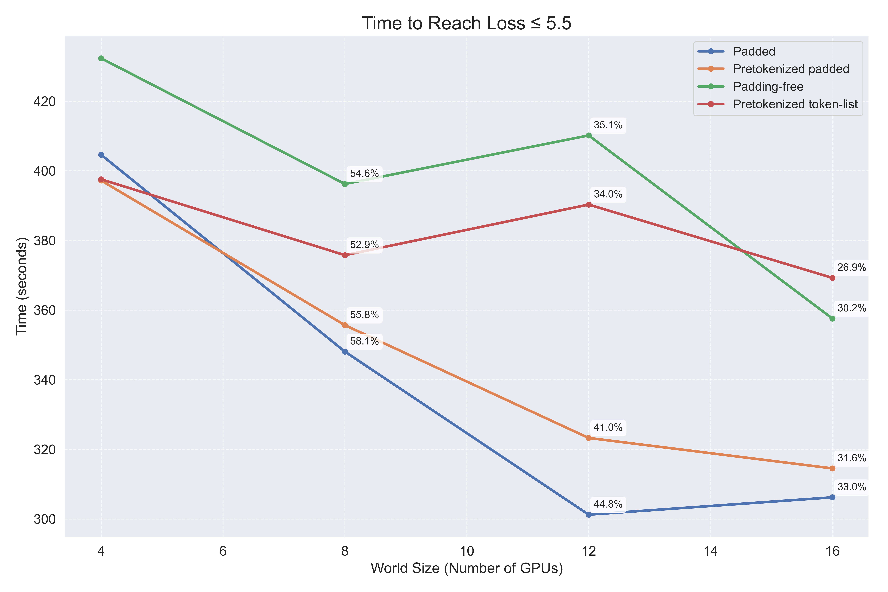
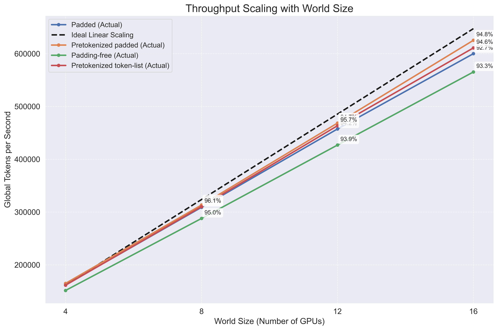

# Large-Scale-AI-Engineering-Project

This repo contains the final project for the "Large Scale AI Engineering" course at ETH Zürich, FS2025. The project implements and evaluates two key features for efficient LLM training on GPU clusters: _**Pretokenization**_ and _**Distributed Data Parallel (DDP)**_.  We conducted our experiments on the Alps cluster at CSCS, which features NVIDIA GH200 GPUs with 120GB of VRAM.

## Project Overview

This project explores two optimization techniques:

1. **Pretokenization:** Training large language models involves converting text to tokens before feeding them to the model. This tokenization process is typically done on-the-fly during training, which might become a bottleneck. This project explores if *pretokenization* – processing the text into tokens beforehand – can improve training efficiency. We implemented and compared four approaches:
  - Standard padded tokenization (baseline)
  - Padding-free tokenization (baseline)
  - Pretokenized padded format
  - Pretokenized token-list format

2. **Distributed Data Parallel (DDP):** Scaling training across multiple GPUs and nodes, which involves:
  - Data sharding across processes
  - Model replication with gradient synchronization
  - Integration and evaluation with both standard and pretokenized datasets (from above)

## Key Findings

**For implementation details, results, and analysis, please see the full reports: [Pretokenization](report/report_pretokenization.pdf) and [DDP](report/report_ddp.pdf).**

### Pretokenization

- In isolated benchmarks, pretokenization achieved up to **5.9× faster** processing speeds
- The token-list format improved storage efficiency 
- Despite these improvements, overall training throughput showed minimal differences
- The observations suggest benefits might increase with larger batch sizes

### Distributed Data Parallel

- Achieved 92-96% scaling throughput efficiency across 4-16 GPUs
- Pretokenized approaches maintained better hardware utilization (MFU) at scale
- Larger world sizes achieved better convergence per training step
- When combined with pretokenization, DDP showed compounding benefits at larger scales

## How to Run

For running on the CSCS Alps cluster, see the SLURM job scripts in the `scripts` directory that configure the environment settings for all experiment configurations and can be started as `sbatch` jobs.

### Step 1: Pretokenize the Dataset

```bash
python pretokenize.py \
  --input-path /path/to/train_data.parquet \
  --output-dir /path/to/output \
  --tokenizer-name unsloth/Mistral-Nemo-Base-2407-bnb-4bit \
  --max-length 2048 \
  --batch-size 100 \
  --format padded token-list
```

This creates two output files:
- `train_data_tokenized_padded_snappy.parquet`
- `train_data_tokenized_token-list_snappy.parquet`

### Step 2: Train Using Pretokenized Data

```bash
python src/train.py \
  --dataset /path/to/train_data_tokenized_padded_snappy.parquet \
  --dataset-type padded \
  --pretokenized \
  --sequence-length 2048 \
  --batch-size 2 \
  --learning-rate 5e-5 \
  --lr-warmup-steps 100 \
  --training-steps 1000
```

### Step 3: Scale with Distributed Training (Multiple GPUs)

```bash
torchrun \
  --nnodes=2 \
  --node_rank=$SLURM_NODEID \
  --nproc_per_node=4 \
  --master_addr=$MASTER_ADDR \
  --master_port=12345 \
  src/train.py \
  --distributed \
  --dataset /path/to/train_data_tokenized_padded_snappy.parquet \
  --dataset-type padded \
  --pretokenized \s
  --sequence-length 2048 \
  --batch-size 8 \
  --learning-rate 5e-5 \
  --lr-warmup-steps 100 \
  --training-steps 1000
```

For additional run configurations and SLURM job scripts, see the `scripts` directory.

## Project Structure

- `src/preprocessing/pretokenize.py`: Script for pretokenizing datasets
- `src/data/pretokenized_dataset.py`: Dataset implementations for pretokenized data
- `src/distr/`: DDP implementation including samplers and data utilities
- `analysis/`: Benchmark and analysis scripts
- `scripts/`: SLURM job scripts for CSCS Alps cluster
- `report/`: Detailed project report and findings

## Performance Previews

### Pretokenization Speedup

The chart below shows the remarkable processing speedup achieved by pretokenization in isolation, though this doesn't directly translate to overall training speed improvements as explained in the full report.

<p align="center">
    
</p>

However, this dramatic speedup doesn't directly translate to overall training performance. With `batch_size=2`, the pretokenized `token-list` approach shows only a minimal benefit (0.9% faster):

<p align="center">
    
</p>

The [Pretokenization report](report/report_pretokenization.pdf) explains this discrepancy and tries to argument why GPU computation – not tokenization – is the main bottleneck in LLM training.

### DDP Scaling Efficiency

DDP achieves remarkable scaling across multiple nodes, significantly reducing the time needed to reach target performance:

<p align="center">
    
</p>

Additionally, _throughput_ scales nearly linearly with world size, maintaining 92-96% efficiency even at 16 GPUs:

<p align="center">
    
    
</p>

The combination of pretokenization with DDP reveals an important synergistic effect: pretokenized approaches maintain consistently higher hardware utilization (MFU) at larger scales, which demonstrates that these optimizations complement each other effectively.

The [DDP report](report/report_ddp.pdf) provides a detailed analysis of these findings.