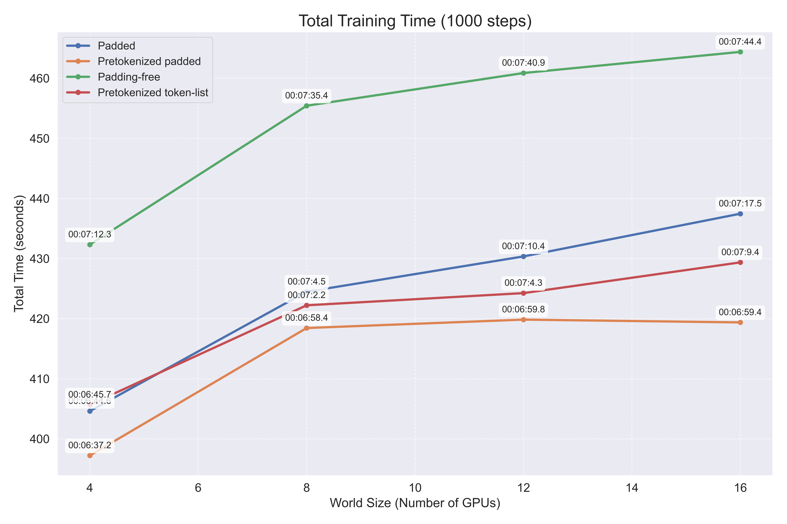

# Appendix

## Implementation `DistributedSampler`

```python
class DistributedSampler(Sampler):
    
    def __init__(self, dataset: Dataset, num_replicas: Optional[int] = None, rank: Optional[int] = None, shuffle: bool = True, seed: int = 0, drop_last: bool = False) -> None:
        if num_replicas is None:
            num_replicas = torch.distributed.get_world_size()
        if rank is None:
            rank = torch.distributed.get_rank()
        self.dataset = dataset
        self.num_replicas = num_replicas
        self.rank = rank
        self.epoch = 0
        self.drop_last = drop_last
        
        # If the dataset length is known
        if hasattr(dataset, "__len__"):
            self.num_samples = len(dataset) // self.num_replicas
            if not self.drop_last and len(dataset) % self.num_replicas != 0:
                # Extra samples to distribute among ranks
                self.num_samples += 1
            # Determine the global offset for each process
            self.total_size = self.num_samples * self.num_replicas
            # Record key parameters used
            self.shuffle = shuffle
            self.seed = seed
        else:
            # For iterable datasets where length is unknown, we just track epoch for seed changes
            self.shuffle = shuffle
            self.seed = seed
            
    def __iter__(self) -> Iterator:
        if hasattr(self.dataset, "__len__"):
            # Map-style datasets with known length 
            if self.shuffle:
                # deterministically shuffle based on epoch and seed
                g = torch.Generator()
                g.manual_seed(self.seed + self.epoch)
                indices = torch.randperm(len(self.dataset), generator=g).tolist()
            else:
                indices = list(range(len(self.dataset)))
                
            # Ensure all workers process the same number of samples
            if not self.drop_last:
                # Add extra samples to make it evenly divisible
                padding_size = self.total_size - len(indices)
                if padding_size > 0:
                    indices += indices[:padding_size]
            else:
                # Remove tail of data to make it evenly divisible
                indices = indices[:self.total_size]
                
            # Subsample
            assert len(indices) == self.total_size
            indices = indices[self.rank:self.total_size:self.num_replicas]
            assert len(indices) == self.num_samples
            return iter(indices)
        else:
            # The actual sharding is done by the IterableDataset itself
            return iter(range(self.num_replicas))
    
    def __len__(self) -> int:
        if hasattr(self.dataset, "__len__"):
            return self.num_samples
        else:
            # For iterable datasets, we cannot know the length in advance
            return 0
    
    def set_epoch(self, epoch: int) -> None:
        self.epoch = epoch
```

## Absolute Training Time

We see that the (absolute) training time increases with increasing world size. This is because each step takes longer because of gradient synchronization overhead, however, we also process more data per step (because `global batch size = local batch size × world size`).

