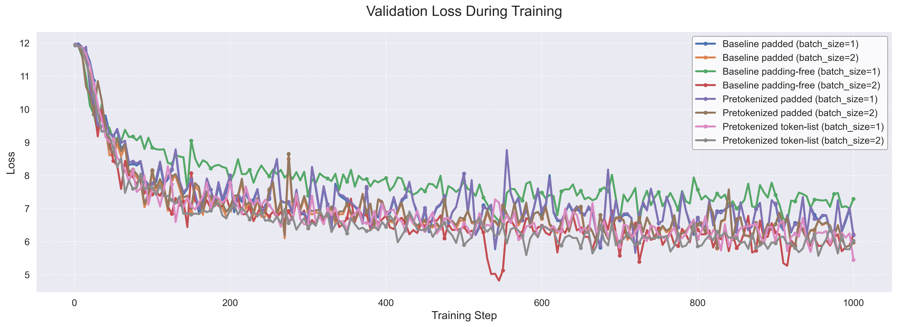
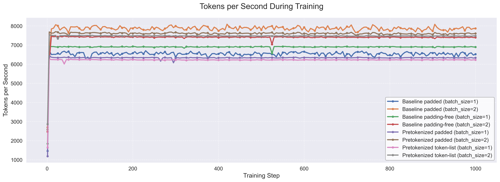

# Appendix

## Implementation of the DataLoaders

The `PreTokenizedDataset` handles the padded version, simply loading the pretokenized data from the parquet file:

```python
class PreTokenizedDataset(Dataset):
    """Dataset for pretokenized padded data."""
    def __init__(self, parquet_file, sequence_length, training_samples):
        self.parquet_ds = pq.read_table(parquet_file, memory_map=True)
        self.real_length = len(self.parquet_ds)
        self.sequence_length = sequence_length
        self.training_samples = training_samples

    def __len__(self):
        return self.training_samples

    def __getitem__(self, idx):
        actual_idx = idx % self.real_length
        # Direct access to pretokenized data - key optimization point
        return {
            "input_ids": self.parquet_ds["input_ids"][actual_idx].as_py(),
            "attention_mask": self.parquet_ds["attention_mask"][actual_idx].as_py()
        }
```

The `IterablePreTokenizedDataset` handles padding-free streaming, carefully preserving the original token sequencing logic:

```python
class IterablePreTokenizedDataset(IterableDataset):
    """Streams pretokenized tokens without padding."""
    def __init__(self, parquet_file, sequence_length, bos_token_id=1):
        self.parquet_ds = pq.read_table(parquet_file, memory_map=True)
        self.real_length = len(self.parquet_ds)
        self.sequence_length = sequence_length
        self.bos_token_id = bos_token_id
        self.current_index = 0
        self.token_buffer = []

    def __next__(self):
        # Fill buffer until we have enough tokens
        while len(self.token_buffer) < self.sequence_length + 1:
            if self.current_index >= self.real_length:
                self.current_index = 0
            
            # Direct access to pretokenized tokens
            tokens = self.parquet_ds["tokens"][self.current_index].as_py()
            self.current_index += 1
            
            # Preserve BOS token handling logic from original implementation
            if not self.token_buffer or self.token_buffer[-1] != self.bos_token_id:
                self.token_buffer.append(self.bos_token_id)
                
            self.token_buffer.extend(tokens)
        
        token_sample = self.token_buffer[:self.sequence_length + 1]
        if len(self.token_buffer) > self.sequence_length + 1:
            self.token_buffer = self.token_buffer[self.sequence_length:]
        else:
            self.token_buffer = []
        
        inputs = torch.tensor(token_sample[:-1])
        labels = torch.tensor(token_sample[1:])
        
        # Mask loss for tokens after BOS
        bos_positions = (inputs == self.bos_token_id).nonzero(as_tuple=True)[0]
        for pos in bos_positions:
            if pos < len(labels):
                labels[pos] = -100
        
        return inputs, labels
```

## Training Loss

The following plot shows the training loss over time, using different on-the-fly and pretokenization approaches. We can see that pretokenization does not hurt performance.




## Training Performance Over Time

While the results section presents average performance metrics, examining how these metrics evolve during training provides additional insights. These charts confirm that the relative performance differences between approaches remain consistent throughout training, with no significant degradation or improvement over time.


